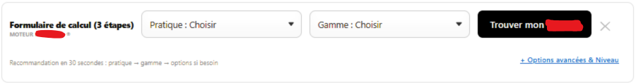
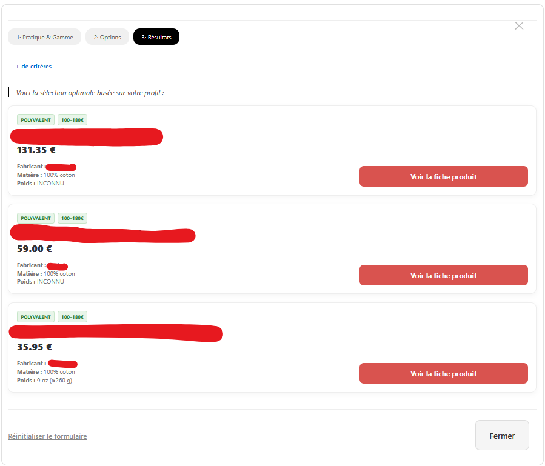

# Optimisation-du-Tunnel-de-Conversion-E-commerce
Assistant d'aide à la décision (JS) optimisant la conversion e-commerce. Extraction de données via LLM, scoring pondéré et filtrage dynamique pour transformer un catalogue complexe (+110 refs) en un parcours personnalisé. Solution scalable centrée sur la qualité de la donnée et la réduction de la friction client. #DataAnalysis #JS #AI

## **Executive Summary**
**Problématique Business :** Au sein d'une boutique spécialisée disposant d'un catalogue de plus de **110 références techniques**, la densité de l'offre générait une **paralysie décisionnelle** chez les prospects. 

**Solution :** Développement d'un **assistant d'aide à la décision** (Widget JS) condensant l'expertise produit de l'entreprise dans un parcours interactif de **30 secondes**.

**Résultat :** Mise en place d'un tunnel **"Fast-Track"** qui réduit la charge cognitive et aligne précisément l'offre disponible avec les besoins techniques (usage, niveau, budget) de l'utilisateur.

---

## **The Problem-Solution Stack**
* **Data Sourcing :** Extraction et structuration de données via **LLM** (Large Language Models) pour le traitement des fiches produits.
* **Data Management :** Consolidation sur tableur et export au format **TSV** (Tab-Separated Values) pour l'injection logicielle.
* **Engine :** **Vanilla JavaScript** (Logique de scoring et moteur de filtrage).
* **IA :** **Prompt Engineering** itératif pour la génération du code source et la normalisation des attributs.

---

## **Architecture des Données et Pipeline**

### **1. Extraction et Normalisation (AI-Assisted)**
Le catalogue a été traité pour transformer des données textuelles non structurées en une **base de données relationnelle** exploitable.
* **Standardisation :** Définition de nomenclatures strictes pour les attributs techniques avant la phase d'extraction afin d'éliminer les doublons sémantiques ou imprécisions des réponses.
* **Data Cleaning :** Identification et correction des anomalies de saisie et des valeurs hors-normes détectées lors du traitement automatisé.
* **Data Integrity :** Implémentation de **valeurs de secours** (fallbacks) pour les données manquantes afin de maintenir la continuité de l'algorithme.

### **2. Moteur de Recommandation : Logique Décisionnelle**
L'algorithme repose sur une architecture de décision hybride :
* **Filtres Exclusifs :** Conditions restrictives basées sur des critères discriminants (catégorie d'utilisateur, certifications requises, genre).
* **Scoring Pondéré :** Système de points hiérarchisant les produits selon leur proximité avec les préférences de l'utilisateur. Bien que seuls des filtres exclusifs soient utilisés, l'algorithme hiérarchise l'importance des critères dès lors qu'un arbitrage est nécessaire.
* **Arbitrage Business :** Application d'un coefficient de **popularité** pour départager les produits présentant un score de pertinence identique (basé sur le chiffre d'affaires du modèle sur un an et deux mois).

---

## **Procédé de Développement (AI-Assisted Engineering)**

Ce projet démontre une capacité à piloter des outils d'Intelligence Artificielle pour livrer une solution technique personnalisée :

1.  **Conception de la Matrice :** Création et structuration de la source de données au format **TSV**. L'injection manuelle de cette base dans le code garantit le contrôle total de la **"Source de Vérité"**.
2.  **Pilotage Technique :** Traduction des besoins métier en instructions de code itératives (fonctions de parsing, algorithme de calcul de score, interface utilisateur responsive).
3.  **Contrôle Qualité :** Revue critique du code produit, débogage des fonctions de tri et optimisation des performances d'affichage côté client.

---

## **Validation et Recette Fonctionnelle (UAT)**

Une phase de tests rigoureux a été menée pour valider la fiabilité des recommandations :
* **Personas de Test :** Création de profils types contrastés (profil débutant à budget contraint vs profil expert à haute exigence technique).
* **Vérification directe :** Comparaison systématique des sorties de l'algorithme avec les **recommandations théoriques** d'experts métier (en l'occurrence, mes connaissances).
* **Optimisation Logique :** Affinement itératif des règles métier pour garantir la pertinence des résultats dans les cas complexes (ex : priorités absolues sur certains segments cibles ou exclusions strictes entre catégories incompatibles).

---

## **Optimisations Additionnelles**
* **Évolutivité :** Le système est conçu pour intégrer de nouvelles références par **simple mise à jour de la matrice de données**, sans modification du code source.
* **Transparence UX :** Utilisation d'indicateurs visuels de conformité pour expliquer la pertinence de la recommandation, favorisant la **confiance** et la **conversion**.

---

## **Structure du Dépôt**
* `/data` : Matrice de données TSV (données anonymisées).
* `/src` : Code source du moteur (HTML/JS/CSS).
* `/docs` : Documentation de la logique de pondération et comptes-rendus de tests.

## Aperçu de l'interface

  
    
  

> **Note :** L'interface est optimisée pour la conversion avec un parcours utilisateur en 3 étapes clés, suivi d'un moteur de scoring pondéré par la performance commerciale.
